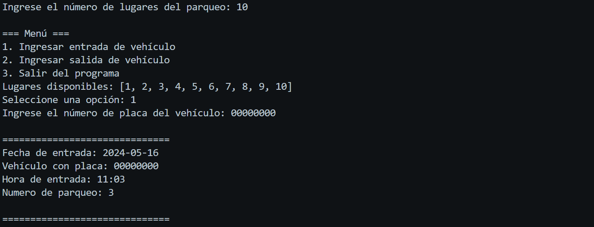

# Aplicación de Estacionamiento


Esta es una aplicación simple para gestionar un estacionamiento. Permite ingresar vehículos, registrar su salida, calcular el tiempo de estancia y el costo, y mostrar un recibo al usuario.


## Uso
Ejecutar el script 
```bash
app.py
```
Seleccionar la opción deseada del menú:
1. Ingresar entrada de vehículo.
2. Ingresar salida de vehículo.
3. Salir del programa.

Seguir las instrucciones en pantalla para ingresar la placa del vehículo y confirmar la acción.


## Contributing 

Si deseas mejorar esta aplicación, por favor sigue los siguientes pasos:

- Haz un fork del repositorio.
- Crea una nueva rama (git checkout -b feature/nueva-funcionalidad).
 - Realiza tus cambios y haz commit (git commit -am 'Añadida nueva funcionalidad').
- Haz push a la rama (git push origin feature/nueva-funcionalidad).
Crea un nuevo pull request.
